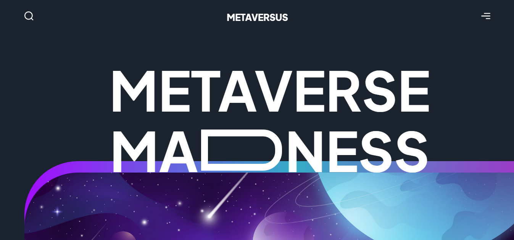
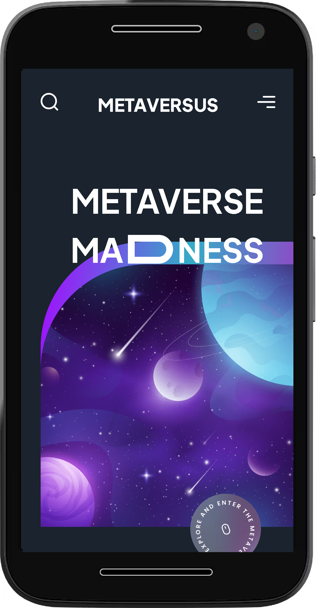

# Metaversus

## Descripción

Código base de la interfaz Metaversus Hecha en React.js, Framer Motion y Tailwind CSS.

---

## Vista En Versión Desktop

## Vista En Versión Mobile

---

## Enlace A La Aplicación

- [Metaversus](https://modern-ui-metaversus.netlify.app/)

---

## Comandos

- npm i
- npm run dev
- npm run build

---

## Dependencias

- React
- Eslint
- Framer Motion

---

## Dependencias De Desarrollo

- Autoprefixer
- Eslint
- Post CSS
- Pretier
- Pretier Plugin Tailwind CSS
- Tailwind CSS
